# Apex Legends Config and Windows Settings

I'd like to share my settings and configurations with you, including Windows and NVIDIA settings, to help you achieve an optimal gaming experience without micro stutters and FPS lags. 
Remember, the effectiveness of these settings can vary based on your system and peripherals.
In this guide, you will find information on various settings:
- [Apex Legends Guide](#Apex-Legends-Optimization-Guide)
- - [Apex Legends Guide](#Apex-Legends-Optimization-Guide)
- - [Apex Startup Options](#Steam-Game-Launch-Options)
- - [Video Configuration](#Video-Configuration)
- - [Autoexec Configuration](#Autoexec-Configuration)
- [Windows Settings](#Windows-Settings-Guide)
- - [Ultimate Performance](#Ultimate-Performance-Mode-in-Windows)
- - [Improve Internet performance](#Improve-Internet-performance-with-the-right-MTU-size)
- [NVIDIA Settings](#NVIDIA-Guide)
- - [NVIDIA New Driver](#New-NVIDIA-Driver)
- - [NVIDIA Display](#NVIDIA-Display-Settings)
- - [NVIDIA 3D Settings](#NVIDIA-3D-Settings)
#### By the way, it doesn't make any difference how good your settings and fps are - almost every console player with 0.6 AA will outgun you. Aloo have fun :)


I also got some of my settings from these creators: [V3nilla](https://github.com/V3nilla), [kretz1xD](https://github.com/kretz1xD), [deaFPS](https://github.com/deaFPS). The content they provide is truly impressive. Make sure to check them out if you're interested.


## Apex Legends Optimization Guide

This repository is designed to enhance your gameplay experience in Apex Legends through detailed configurations and optimizations for video settings, Windows settings, and NVIDIA settings, aimed at reducing micro stutters and FPS lags.


### Steam Game Launch Options

To optimize your gameplay, add the following commands to your launch options in Steam:

| Command          | Description |
|------------------|-------------|
| `+exec`          | Executes a cfg file on startup |
| `-dev`           | Skips EA intro on startup, can cause HUD flicker issues on NVIDIA cards |
| `-fullscreen`    | Forces the game to launch in fullscreen mode |
| `-high`          | Gives high priority to the game in system processes |
| `-preload`       | Preloads game assets |
| `-forcenovsync`  | Disables vertical sync |
| `-m_rawinput 1`  | Ensures raw input is used for mouse movements |

Example of full command line: `-high -preload -forcenovsync -dev -fullscreen +exec autoexec.cfg -m_rawinput 1`


### Video Configuration
This section explains the purpose and effects of various settings in the `videoconfig.txt` file to improve game performance and visual quality:


Adjust the following in your `videoconfig.txt` for optimal frame timing:
- **Original Frame Time**:
  - Minimum: `"15000"`
  - Maximum: `"15000"`
  - Optimal for 190 FPS: "setting.dvs_gpuframetime_min"	`"5150"`
                         "setting.dvs_gpuframetime_min"	`"5150"`
  - Optimal for 240 FPS: "setting.dvs_gpuframetime_min" `"4166"`
                         "setting.dvs_gpuframetime_min"	`"4166"`     
  - Optimal for 299 FPS: "setting.dvs_gpuframetime_min" `"3340"`
                         "setting.dvs_gpuframetime_min"	`"3340"`

- **Particle Levels**: Reduced to ensure minimal distraction and improve performance.
- **Ragdoll Effects**: Disabled to decrease CPU load.
- **Shadow and Lighting Effects**: Minimized to enhance FPS.

[Videoconfig.txt](https://github.com/w0nxyApex/Apex-Legends-Config-And-Windows-Settings/blob/main/videoconfig.txt).
You can simply copy my Videoconfig.txt and use it and replace yours with it. But check which fps you are playing at to set the correct frame times.

#### And set the file to read only otherwise the game will change settings again.
<p align="center">
  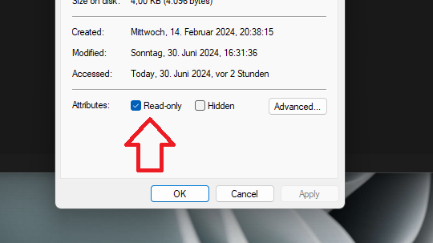
</p>


### Autoexec Configuration

The `autoexec.cfg` file pre-loads specific commands to enhance performance and in-game behavior:

- Privacy settings!! Disables EA telemetry, Prevents the recording of communication to the server.
- Network optimizations
- Default startup settings
- Graphical adjustments

Place this file in your Steam or Origin storage location in the cfg folder. [autoexec.cfg](https://github.com/w0nxyApex/Apex-Legends-Config-And-Windows-Settings/blob/main/autoexec.cfg).


## Windows Settings Guide

### Ultimate Performance Mode in Windows

#### Overview
The Ultimate Performance Mode in Windows optimizes power settings to enhance system performance. This mode is particularly beneficial for workstations and users requiring maximum performance from their systems.

#### Activation Command

To activate Ultimate Performance Mode, which is not visible by default in Windows, use the following command in your command prompt:

```bash
powercfg -duplicatescheme e9a42b02-d5df-448d-aa00-03f14749eb61
```
This command duplicates the hidden Ultimate Performance power scheme, enabling it for selection.
Enabling Ultimate Performance Mode
<p align="center">
  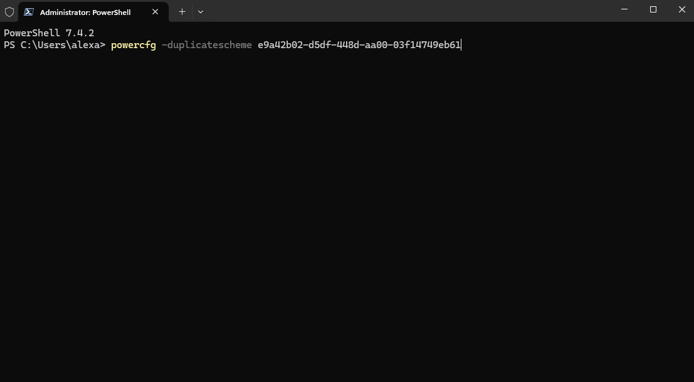
</p>

After running the command, follow these steps to activate the Ultimate Performance Mode:

    Open Control Panel.
    Navigate to Hardware and Sound > Power Options.
    Under Choose or customize a power plan, select Ultimate Performance.

Important Notes

    The Ultimate Performance mode is recommended for users who require maximum performance from their systems and is particularly useful on workstations.
    Power Consumption: Be aware that enabling Ultimate Performance Mode may increase your system's power consumption significantly.
    Recommended Use: This mode is recommended for users who need to maximize their system performance and is not typically necessary for general computing tasks.

This format provides clear instructions and essential details, making it easy for users to understand and implement Ultimate Performance Mode. Adjust the steps as necessary to align with specific user environments or system configurations.

### Improve Internet performance with the right MTU size

#### Calculating the Optimal MTU Size

To determine the optimal MTU size without packet loss, use the `ping` command. Start with a high MTU size and adjust as necessary:

```bash
ping 8.8.8.8 -f -l 1492
```
<p align="center">
  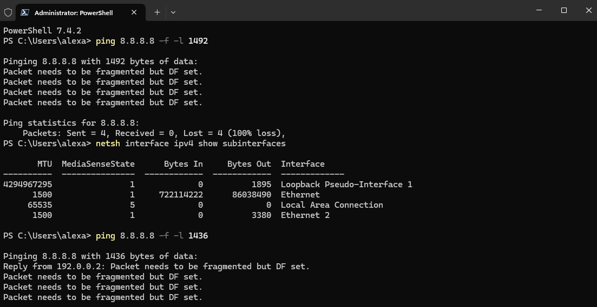
</p>

This command pings google.com with a specific packet size (1492 bytes) while setting the "Don't Fragment" flag.


#### Checking Your Current MTU Size

To view the current MTU size for all network interfaces on your system, use the following command:

```bash

netsh interface ipv4 show subinterfaces
```
If you have found the MTU size that allows your packets to arrive intact, set this size plus 28 as your MTU size.

#### Setting the MTU Size

If you have found the MTU size that your packets arrive in full, set this size + 28 as your MTU size. To set the MTU size for a specific network interface (e.g., Ethernet), use the following command:

```bash
netsh int ipv4 set subinterface "Ethernet" mtu=1500 store=persistent
```

<p align="center">
  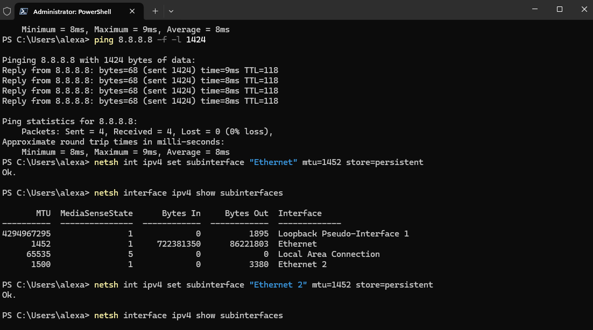
</p>

This command sets the MTU size to 1500 for the Ethernet interface and makes the change persistent across reboots. And make sure you have chosen your largest MTU size that will be displayed without being fragmented. 1500 is maximum.
here is a video from someone (https://www.youtube.com/watch?v=RK2PHpKI9M4)

Notes

    Adjust the MTU values based on your specific network conditions and requirements.


Make sure to replace "Ethernet" with the actual name of your network interface if it differs, and adjust the MTU values as necessary based on the results of your MTU size calculation.

```bash
There are many additional ways to improve your performance in Windows.
You can disable Game Mode, close unused applications, free up memory, and optimize your hard drive and RAM.
Updating drivers, and using disk cleanup tools can also make a significant difference.
Regularly scanning for malware and ensuring that your system is free from unnecessary startup programs can
help maintain optimal performance. Additionally, keeping your system and game files on an SSD rather than a
traditional HDD can greatly enhance load times and overall responsiveness.
```

#### Windows instalation
I would highly recommend that you watch this video before you reinstall your PC next time. Then you have a better Windows installation.([Video](https://www.youtube.com/watch?v=XQAIYCT4f8Q&list=WL&index=6))


## NVIDIA Guide
Optimal NVIDIA 3D settings are provided to ensure the best balance between performance and visual fidelity. Keeping your drivers up to date is crucial to avoid any conflicts. Screenshots of these settings will be provided for easier replication.
You should **delete Nvidia GeForce Expiriance** (because it can cause micro stuters). And also delete your old driver data and perform a clean installation.


### New NVIDIA Driver 
You can download the latest driver here ([Nvidia Treiber](https://www.nvidia.com/de-de/drivers/))
Enter your graphics card type and your Windows installation details on the Nvidia website, then select 'Game Ready' for the latest graphics features or 'Studio Drivers' for the best stability, and download the file.
<p align="center">
  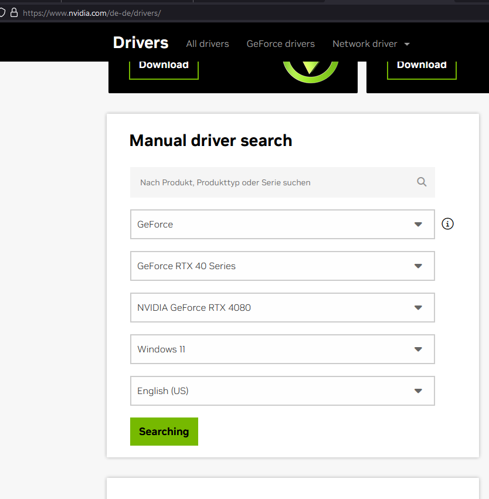
</p>

Ok, you will find the file in your download folder. Double-click on it, 

<p align="center">
  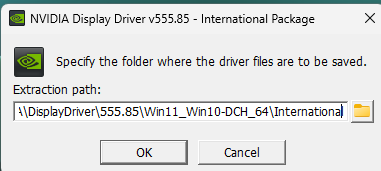
</p>

then follow the instructions as described in the pictures. 
<p align="center">
  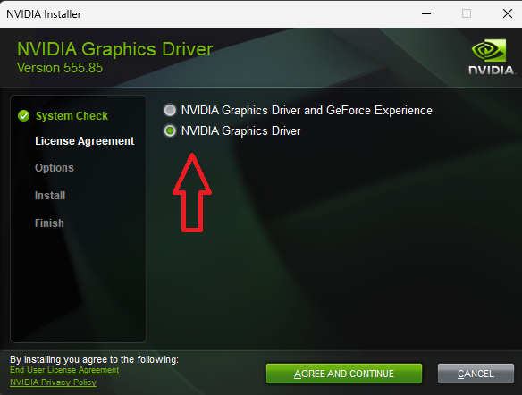
</p>

**Tipp**: Have uninstalled nvidia geforce experience before!
Choose 'Custom Installation' and only install the driver (not GeForce Experience). Then, go ahead and install.
<p align="center">
  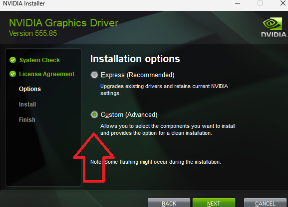
</p>
Click Next to Install. Check mark, Perform a clean installation. If you want to delete all old driver data. That could be good, but you might forget the settings you had before.
<p align="center">
  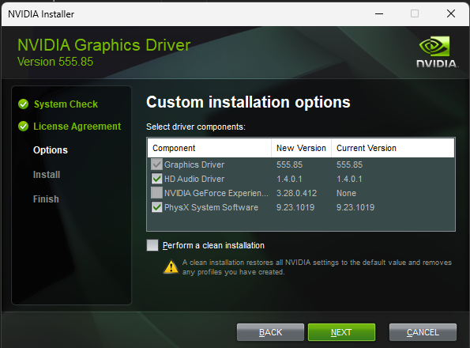
</p>

### NVIDIA Display Settings

Go to the display settings and select the desired resolution and Hz number. The Hz should be as high as possible; in my case, 360. However, if you cannot achieve smooth and constant FPS in your game at the level of your Hz number, choose a lower Hz, such as 240 or 144, whatever you have available. Alternatively, set your FPS to half or a quarter of your Hz number, for example, 180 FPS at 360 Hz, to ensure a smooth image.
<p align="center">
  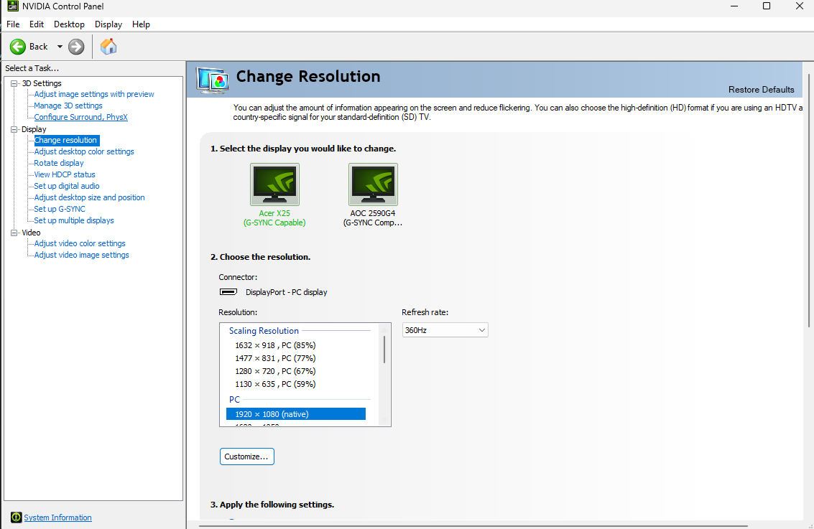
</p>
If you want more intense colors, set your Digital Vibrance high.
<p align="center">
  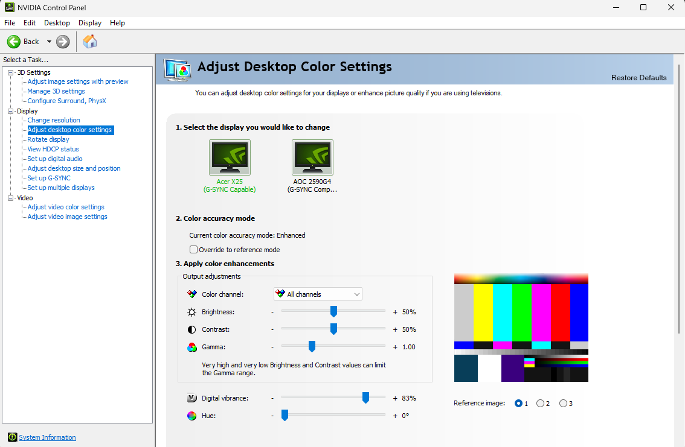
</p>
Choose full screen.
<p align="center">
  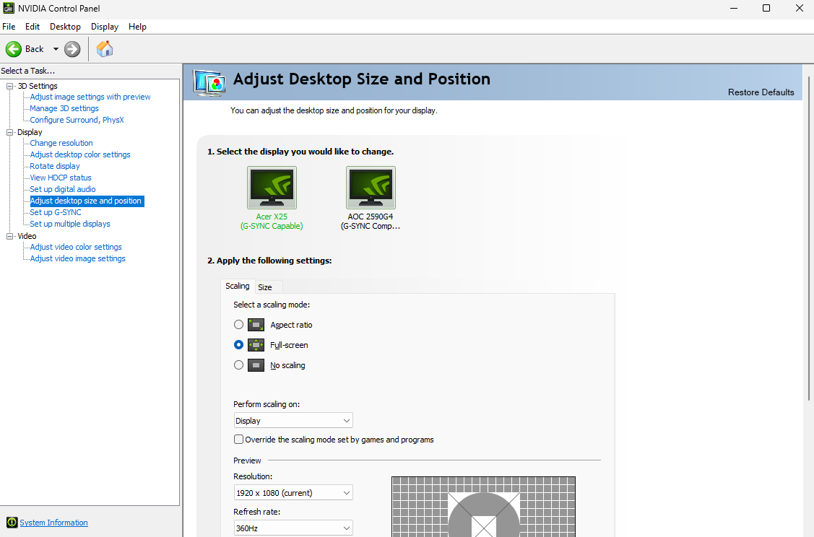
</p>
I do not use G-Sync or FreeSync because I consistently achieve high FPS in my monitor Hz number. G-Sync and FreeSync are technologies developed by NVIDIA and AMD, respectively, designed to eliminate screen tearing and reduce stuttering and input lag by synchronizing the display refresh rate to the output of the GPU. This is especially useful if your FPS fluctuates at the top end. If you experience such fluctuations, consider using G-Sync or FreeSync to stabilize the display performance.
<p align="center">
  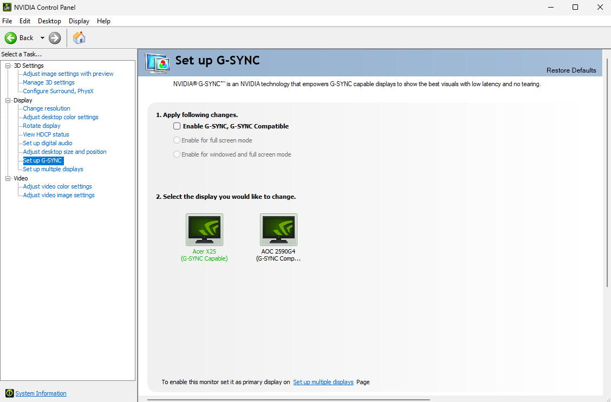
</p>

### NVIDIA 3D Settings

Simply open the Nvidia Control Panel and go to 3D settings, select 'Custom,' select your game (i.e., the Apex r5apex.exe), and then apply the settings as shown in the pictures. 
You will then have good performance, but poor quality
Choose advanced 3D settings
<p align="center">
  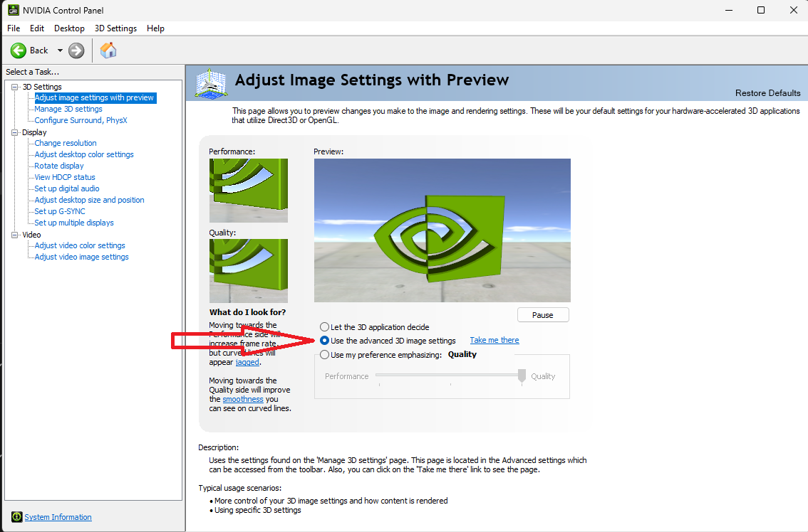
</p>
then go to Manage 3D Settings. Program Settings and select Apex Legends (r5apex.exe). Now apply the settings as in the pictures.
<p align="center">
  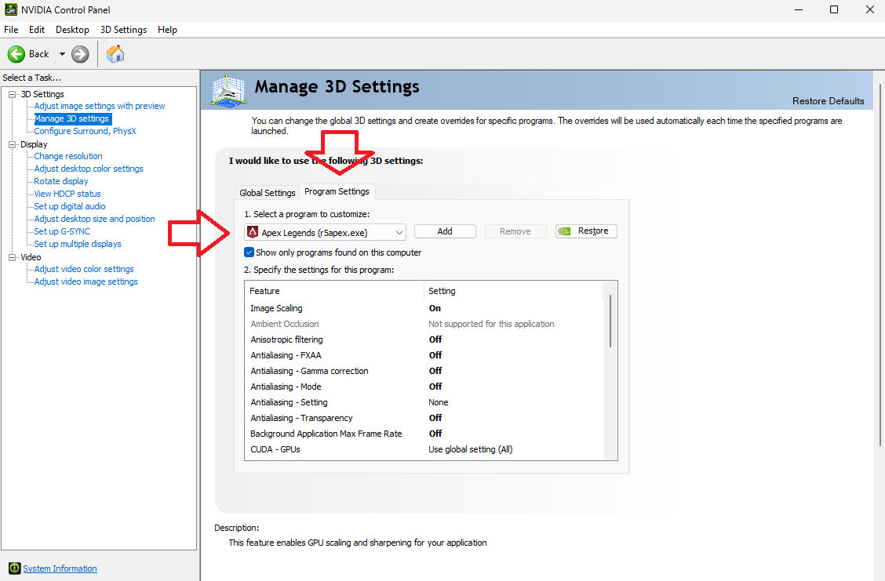
</p>

<p align="center">
  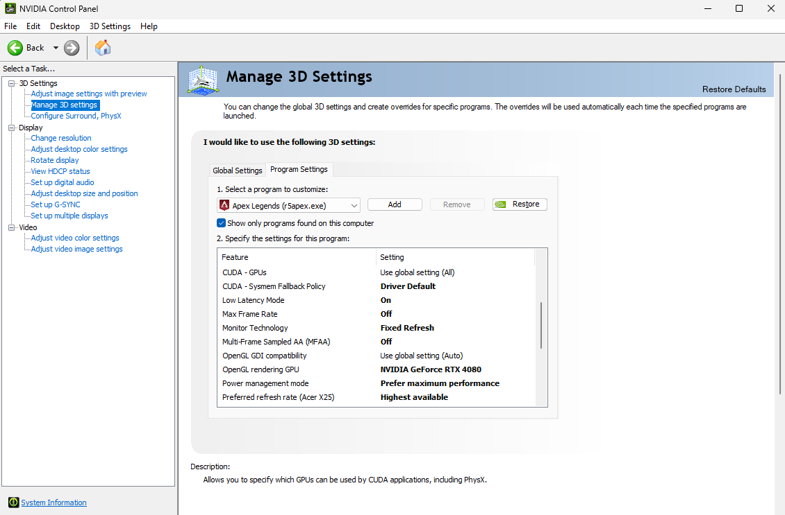
</p>

<p align="center">
  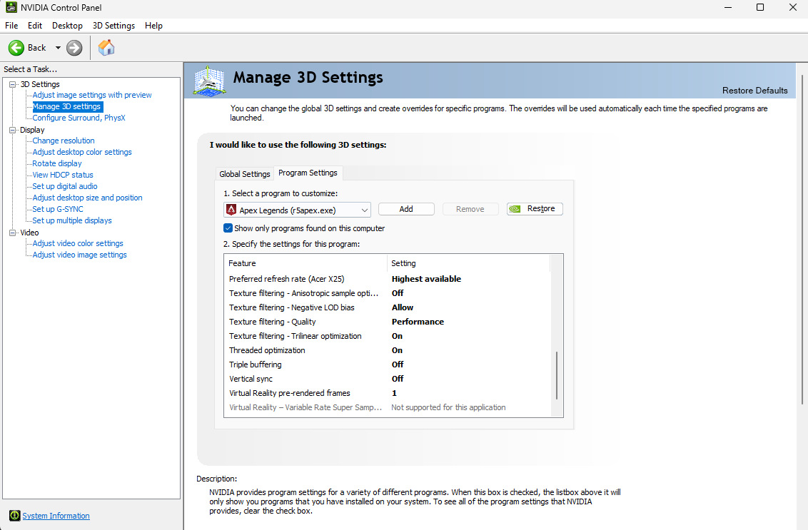
</p>

## Contributing

Contributions are welcome! If you have any tweaks or additional settings that could help improve this guide, please feel free to fork this repository and submit a pull request.

## License

This project
