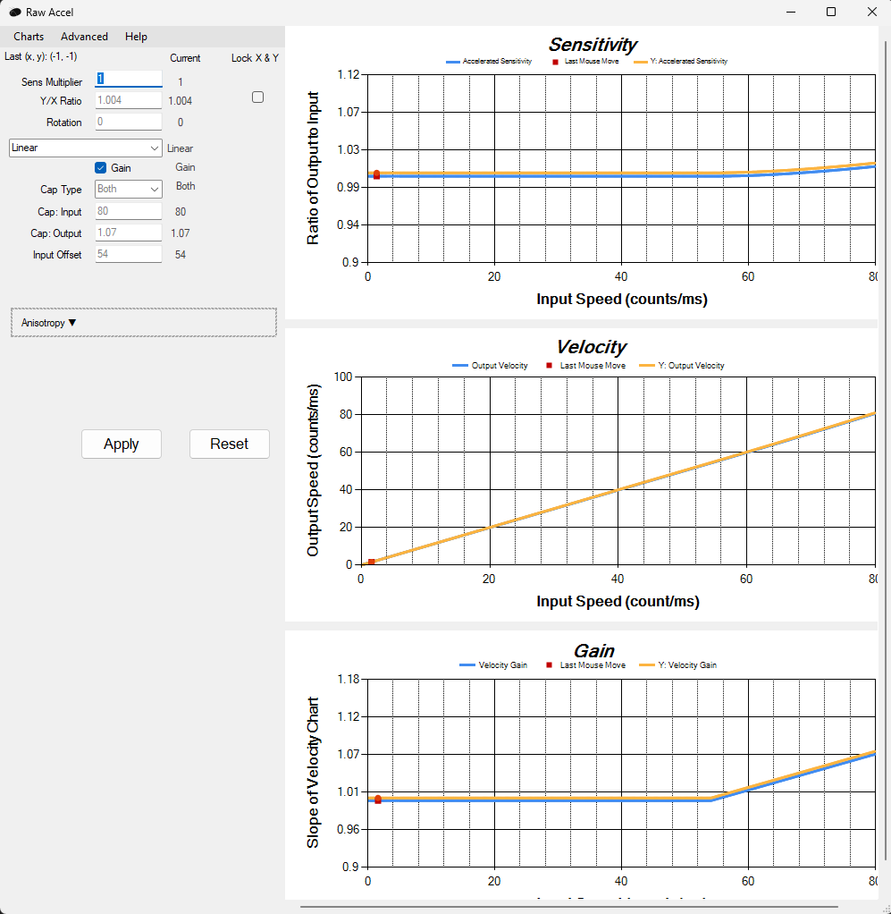

# Rawaccel

## Overview
Rawaccel is a powerful tool for customizing mouse acceleration on Windows. It allows users to create precise acceleration and speed curves for better control and responsiveness. Rawaccel is particularly useful for competitive gamers who require fine-tuned mouse movements.

## Download and Information
You can download Rawaccel and find more information on its GitHub page:

[Rawaccel GitHub Page](https://github.com/a1xd/rawaccel)

## Features
- **Precise Control**: Fine-tune mouse acceleration and speed to achieve the perfect balance between speed and accuracy.
- **Custom Profiles**: Create and save multiple profiles for different games or applications.
- **Open Source**: Rawaccel is open-source, allowing the community to contribute to its development and improvement.
- **Adjustable Curves**: Customize acceleration and speed curves to fit your specific needs.

## Important Note
**I recommend using this application only if you have experience with aiming and have practiced extensively. Rawaccel can provide significant advantages, but it requires understanding and fine-tuning to be effective.**
## Excample

Here are my settings in the picture. I'm using it in a very specific way. I have fast movement for 180+ degree direction changes and slower aim for good tracking of enemies. These settings are tailored to my peripherals, so you will likely need different ones. Therefore, think carefully beforehand about how you want to use this software and what advantage it brings you. What weaknesses in your aim that occur frequently can it improve?

  

## Benefits for Gaming
In games like Apex Legends, Rawaccel can be incredibly useful:
- **High Sensitivity for Fast Movements**: Allows for quick and responsive movements, essential for rapid gameplay and quick turns.
- **Low Sensitivity for Precise Aiming**: Enables precise aiming and tracking, which is crucial for hitting targets accurately.

By adjusting the acceleration curve, you can achieve a setup where fast movements have high sensitivity for swift actions, while slow movements have low sensitivity for accurate aiming.

## Getting Started
1. **Download and Install**: Download Rawaccel from the GitHub page and follow the installation instructions.
2. **Configure Settings**: Open Rawaccel and start configuring your acceleration and speed curves.
3. **Create Profiles**: Set up different profiles for various games or applications to switch between them easily.
4. **Fine-Tuning**: Spend time fine-tuning your settings to find the perfect balance for your playstyle.

## Support and Community
For support and community discussions, visit the [Rawaccel GitHub Page](https://github.com/a1xd/rawaccel) and join the conversation with other users and developers.

---

**Enhance your gaming experience with precise and customizable mouse acceleration using Rawaccel!**
